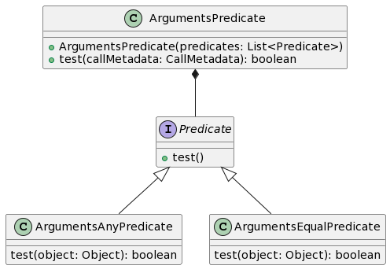

# **About**

Project is an attempt to create a mocking library with features similar to popular mocking frameworks/libraries (ie. Mockito, PowerMock).

<center>
    <h1>Mocking process</h1>
</center>

The base idea behind mocking libraries is to create a fake object, which behaviour a programmer can easily control. This library uses ByteBuddy to dynamicly create a subclass of a class that is desired to be mocked and an object is instantiated with the help of objenesis library omitting the need of constructor knowledge. 
Each mock creates it's own hash based on a date, so they can be recognized and store their metadata separately.
The mock can be simply visualised with a UML class diagram (Fig. 1)

<center>
    
</center>
<center>
    Fig. 1. UML class visualisation of a Mock dynamic subclassing
</center>


example of making a Car class mock

`Car car = Mocker.mock(Car.class);`

After the object creation the methods' default behaviours are overridden by a mocking interceptor. Mocking interceptor's task is to keep track of the mocked object's methods invocations and it's metadata (call arguments, class name, method name).
If it's the first call with the same metadata it is assumed that it is a part of mocking process, which means that such data is stored for later use. If the same metadata is being used more times, the associated fake return expression is executed.
The first invocation is best fit in the `Mocker.when()` method, as it tracks down an invocation object and returns it for further usage. 

<center>
    <h1>Mock container</h1>
</center>

Each method invocation is registered in a global mock container. MockContainer Class is responsible for registering method invocations, and retrieving a correct list of methods based on a passed hash.

<center>
    <h1>Mocking process</h1>
</center>

MockingProcess class represents the currently ongoing operations on mock. It's purpose is to separate processes connected with creation of the mock from internal states of the mock and it's invocations.
To support multithreading each thread has a separate MockingProcess object contained within a ThreadLocal.
This way threads can work on the same mock and not interfere with each other.

<center>
    <h1>Method invocations and argument matching</h1>
</center>

InvocationDetails class is one of the core classes of the project, as it represents a called method.
It stores the call metadata (arguments and their types), previous invocations' arguments, stubbed response chain and a currently applied verification strategy.


<h2>Method recognition and arguments</h2>

When a method is called on a mock, the mock's hash is used to extract all the methods from mock container.
Method invocation objects are recognized by the hash of their owning object, argument types and method name. 
Then the argument predicates are used to invoke a correct behaviour. 
Argument predicates are created with the use of a special Matcher class or created on the fly based on passed arguments.


<h2>Argument matching</h2>

Matcher class defines static methods to retrieve custom argument predicates. For example an Any predicate returns true for every object that is passed, while Equal predicate tests argument against a defined value.
Calling matchers registers them in the MockingProgress object and these are used when invocation occurs. All of the argument predicates are grouped into a bigger ArgumentsPredicate object.

<center>
    
</center>
<center>
    Fig. 2. UML class diagram of argument predication participating classes
</center>

<h2>Method invocation</h2>

Mocked method behaviours are expressed by MockedExpression interface. The MethodInvocation object contains a list of ArgumentPredicates and MockedExpressions
and because of this it is possible to register certain behaviour when argument predicates' criteria are met.

If a new behaviour is registered with the usage of ``thenReturn(), thenAnswer(), thenThrow()`` calls, last ArgumentsPredicate is used as a key.
Next invocations will test their argument's against predicates, and then the chosen MockedExpression will be invoked.

<center>
    <h1>Method verification</h1>
</center>

Using a system of verification strategies a method invocation can be checked for number of invocations and certain argument's being passed.
There are two classes, that are the primary verification strategies InvokationArgumentsVerificationStrategySingle and InvokationArgumentsVerificationStrategyMulti.
the first one is used when ```verify(mock)``` method is called with only a mock argument, and it verifies whether a method was called with matching arguments.
The second form ```verify(mock, strategy)``` uses an additional strategy. First a primary strategy is performed that filters out previous calls with arguments predicates, thus creating a list of matching invocations for a secondary strategy. 
Second strategy checks if a given criteria are met within filtered list of historical calls. First strategy is used as a wrapper of a secondary lesser strategy. If verification strategy fails, it throws an exception.